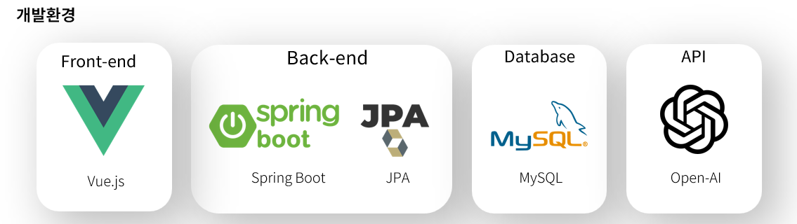
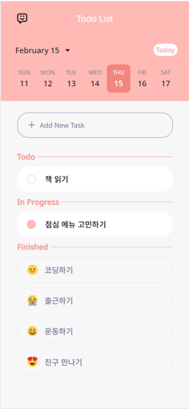
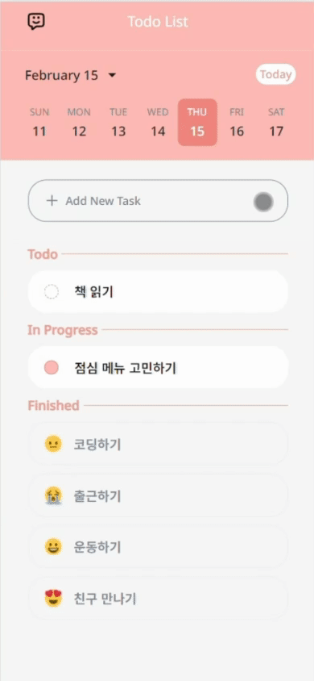
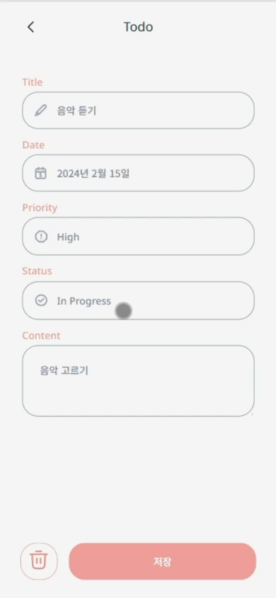
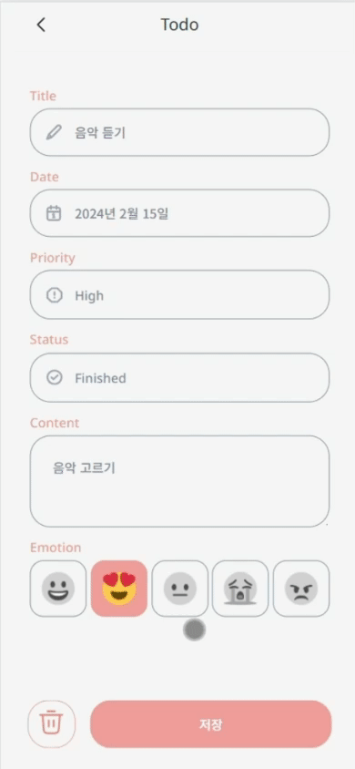

# Save The Day

> 오늘의 할 일을 관리하고 감정과 함께 마무리해보세요  

### 목차
1️⃣ [프로젝트 개요](#-프로젝트-개요)<br>
2️⃣ [주요 기능](#-주요-기능)<br>
3️⃣ [실행 방법](#-실행-방법)<br>
<br>

## 📜 프로젝트 개요

### 📆 프로젝트 기간: 2024.01.29 ~ 2024.02.15 (3주)

### 👤 개발 인원: 1명

### 🎶 서비스 소개

- 할 일 관리를 위한 모바일 웹
- 일을 완료한 뒤 일을 했을 때의 감정을 함께 입력해 일기의 효과를 가져옵니다
- 생성형 AI를 통해 즐겁게 하루를 마무리 할 수 있도록 돕습니다

### 🛠️ 사용 기술



Front-End

- `Vue.js`

Back-End

- `JAVA 17`
- `Spring Boot`
- `Spring Data JPA`

DataBase

- `MySQL`

ETC

- `Open AI API`
    - `GPT 3`
    - `DALL·E 3`
- `Git`
- `Figma`
<br>

## ✨ 주요 기능

### ✏️ 할 일 관리

1. 할 일 등록
    - 할 일, 날짜, 우선 순위, 진행 상태, 상세 정보 기입
    - 
      
        
2. 할 일 확인
    - 일의 진행도를 구분해두어 한 눈에 확인 가능
        
        

        
    
    - 주간/월간 달력으로 날짜 이동 가능
        
      

        
    
3. 감정 기록
    - 완료된 할 일은 감정을 추가할 수 있음
        
      

        
4. 상세보기 및 편집
    - 할 일을 누르면 작성한 세부 내용을 볼 수 있으며 편집 가능
5. 삭제
    - 왼쪽 아래 휴지통 아이콘을 누르면 삭제 가능
        
      


### 🪄 생성형 AI

1. 명언 생성
    - 일상과 관련된 명언 생성
        
      

        
2. 소설 생성
    - 그 날 하루 완료한 일과 감정을 토대로 소설 생성
        
      

        
3. 그림 생성
    - 그 날 완료한 일 중 한 개를 랜덤으로 골라 그 감정으로 해당 일을 하는 고양이의 모습 생성
        
      
        
    
4. 다시 만들기
    - 세가지 모두 다시 만들기를 누르면 새로운 결과 생성 가능
    

## 💡 기대효과

- 모바일로 편리하게 관리할 수 있어 일정 관리의 효율성 증가
- 계획 세우기를 통해 불확실성을 줄여 스트레스 감소
- 감정을 함께 기록함으로써 순간의 감정을 함께 되돌아 볼 수 있음
<br>

## 💻 실행 방법

### 프론트엔드 실행

`Save-The-Day` 폴더 내에서

```bash
cd Frontend\todo-list
npm i
npm run serve
```

### 백엔드 실행

1. `Open AI` API KEY 발급
2. Backend/src/main/resources/application.yml

```yaml
...

gpt:
  key: "OPEN_AI_API_KEY"
```

`OPEN_AI_API_KEY`에 발급받은 API KEY로 변경

이후, Spring Boot Application 실행
